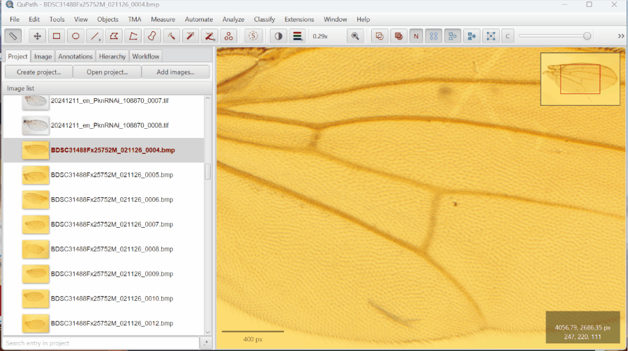

# QuPath Active Image Helper

Quality-of-life improvements for working with the project image list in
[QuPath](https://qupath.github.io/).

QuPath's default image list only distinguishes the currently open image with a
subtle bold font, which is easy to miss in large projects. This extension makes
the active image **visually obvious** and adds convenience actions to the
right-click context menu.



## Features

| Feature | Description |
| --- | --- |
| **Color highlight** | The currently open image name is displayed using QuPath's **default object color** (set in *Edit → Preferences*), so it stands out immediately and stays consistent with your color scheme. |
| **Scroll to current image** | Right-click the image list and select *Scroll to current image* to jump the list to the active image — useful when you have many images and the active one has scrolled out of view. |
| **Remove current image** | Right-click and select *Remove current image* to close and remove the open image from the project in one step, with confirmation dialogs. QuPath's built-in remove action requires you to close the image first; this streamlines the workflow. |

## Installation

1. Download the latest `.jar` from [Releases](../../releases).
2. Drag the `.jar` onto the QuPath window, or copy it into your QuPath
   `extensions/` directory.
3. Restart QuPath.

## Building from source

The extension uses [Gradle](https://gradle.org/) with the
[QuPath extension conventions plugin](https://github.com/qupath/qupath-extension-template).

```bash
./gradlew build
```

The built `.jar` will be in `build/libs/`.

> **Note:** The build targets **QuPath 0.7.0** and requires **JDK 25**. If you
> don't have JDK 25 installed, add the
> [Foojay Toolchain Resolver](https://github.com/gradle/foojay-toolchains)
> plugin to `settings.gradle.kts` and Gradle will download it automatically:
>
> ```kotlin
> plugins {
>     id("org.gradle.toolchains.foojay-resolver-convention") version "1.0.0"
> }
> ```

## Customizing the highlight color

The highlight color automatically follows QuPath's **default object color**,
which you can change in *Edit → Preferences → Objects → Default color*.
